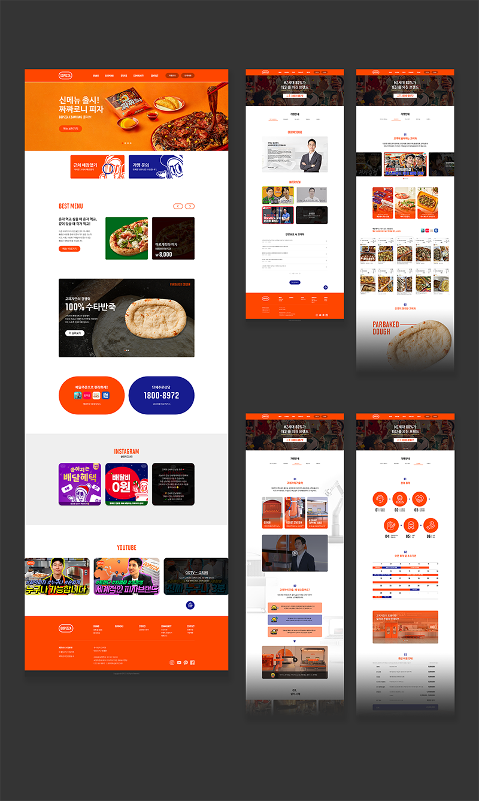

# GOPIZZA 웹사이트 포트폴리오



## 프로젝트 개요

본 프로젝트는 고피자(GOPIZZA) 브랜드의 공식 웹사이트로, 혁신적인 피자 브랜드의 제품과 서비스, 브랜드 정보를 효과적으로 전달하기 위해 개발되었습니다. 사용자 친화적인 인터페이스와 반응형 디자인을 통해 모든 디바이스에서 최적의 경험을 제공합니다.

### 라이브 데모

#### 최근 리뉴얼 정보
- **리뉴얼 버전**: [https://gopizza.kr](https://gopizza.kr) (최신 프로덕션 버전)
- **리뉴얼 전 버전**: [https://gopizzahome-43cr37mzv-gopizza.vercel.app/](https://gopizzahome-43cr37mzv-gopizza.vercel.app/)

> 2025년 4월 기준으로 메인페이지 및 공통 레이아웃의 디자인 리뉴얼이 완료되었습니다.

## 주요 특징 및 기능

- **반응형 디자인**: 모바일, 태블릿, 데스크톱 등 모든 디바이스에 최적화된 UX/UI
- **인터랙티브 메뉴 탐색**: 직관적인 내비게이션과 애니메이션을 통한 사용자 경험 향상
- **매장 위치 검색**: Kakao Maps API를 활용한 지도 기반 매장 검색 기능
- **이벤트 및 프로모션**: 다양한 이벤트와 프로모션 정보 제공
- **인스타그램 피드 통합**: 실시간 브랜드 소셜 미디어 활동 표시
- **YouTube 영상 통합**: 브랜드 관련 영상 콘텐츠 제공
- **다국어 지원**: 글로벌 진출 국가(인도, 싱가포르, 인도네시아, 태국) 사이트 연결
- **가맹 문의 서비스**: 창업 관련 정보 및 문의 기능

## 기술 스택

### 프론트엔드
- **Next.js 13.1.1** - React 기반의 SSR/SSG 프레임워크
- **TypeScript 4.9.4** - 정적 타입 검사를 통한 코드 안정성 확보
- **React 18.2.0** - UI 구성을 위한 JavaScript 라이브러리
- **MobX** - 상태 관리 라이브러리
- **React Query** - 서버 상태 관리 및 데이터 페칭
- **Emotion/Styled Components** - CSS-in-JS 스타일링 솔루션

### UI/UX 라이브러리
- **Swiper** - 터치 슬라이더 구현
- **React Datepicker** - 날짜 선택 컴포넌트
- **React Kakao Maps SDK** - 카카오 지도 통합
- **React Player** - 비디오 플레이어 구현

### API 통신
- **Axios** - HTTP 클라이언트 라이브러리
- **Instagram & YouTube API** - 소셜 미디어 통합

### 배포
- **Vercel** - Next.js 애플리케이션 호스팅

## 프로젝트 구조

```
HomePage/
├── components/            # 재사용 가능한 컴포넌트
│   ├── common/            # 공통 컴포넌트
│   ├── layouts/           # 레이아웃 관련 컴포넌트(헤더, 푸터 등)
│   ├── pageComp/          # 페이지별 전용 컴포넌트
│   ├── popup/             # 팝업 관련 컴포넌트
│   └── Seo.tsx            # SEO 최적화 컴포넌트
├── pages/                 # 페이지 정의
│   ├── brand/             # 브랜드 소개 페이지
│   ├── menu/              # 메뉴 페이지
│   ├── find/              # 매장찾기 페이지
│   ├── event/             # 이벤트 페이지
│   ├── order/             # 단체/제휴문의 페이지
│   ├── start/             # 가맹안내 페이지
│   ├── _app.tsx           # Next.js 앱 컴포넌트
│   ├── _document.tsx      # HTML 문서 구조 정의
│   ├── index.tsx          # 초기 랜딩 페이지
│   └── main.tsx           # 메인 홈페이지
├── public/                # 정적 파일 (이미지, 아이콘 등)
├── src/                   # 소스 코드
├── styles/                # 글로벌 스타일
├── next.config.js         # Next.js 설정
└── package.json           # 프로젝트 의존성 및 스크립트
```

## 주요 페이지

### 브랜드 소개
- **OUR STORY** - 브랜드 아이덴티티와 철학
- **THE WAY WE MAKE** - 고피자만의 특별한 제조 방식
- **GO GLOBAL** - 글로벌 진출 현황 및 전략

### 메뉴
- 다양한 카테고리별 피자 및 사이드 메뉴 소개
- 영양 정보 및 알레르기 정보 제공

### 매장찾기
- 카카오맵 API를 활용한 위치 기반 매장 검색
- 매장별 정보 (영업시간, 연락처, 서비스 등) 제공

### 이벤트
- **PROMOTION** - 진행 중인 프로모션 및 할인 정보
- **VIDEO** - 브랜드 관련 영상 콘텐츠

### 단체/제휴문의
- **단체주문** - 대량 주문 문의 양식
- **기업제휴** - 기업 파트너십 문의
- **고객문의** - 일반 고객 문의 창구
- **찾아오시는길** - 본사 위치 안내

### 가맹안내
- **창업경쟁력** - 고피자 프랜차이즈의 경쟁력 소개
- **창업안내** - 가맹점 창업 프로세스 및 비용 안내
- **혁신기술력** - 브랜드의 기술적 차별점
- **CEO&언론보도** - 경영진 소개 및 미디어 노출
- **가맹문의** - 창업 문의 양식

## 설치 및 실행 방법

### 사전 요구사항
- Node.js 14.x 이상
- Yarn 패키지 매니저

### 설치
```bash
# 저장소 복제
git clone https://github.com/your-username/HomePage.git

# 프로젝트 디렉토리로 이동
cd HomePage

# 의존성 설치
yarn install
```

### 개발 서버 실행
```bash
yarn dev
```
http://localhost:3000 으로 접속하여 개발 서버에 접근할 수 있습니다.

### 프로덕션 빌드
```bash
yarn build
```

### 프로덕션 서버 실행
```bash
yarn start
```

## 프로젝트 개발 주요 사항

### 반응형 디자인 최적화
- 모바일과 데스크톱 환경에서 일관된 사용자 경험을 제공하기 위해 다양한 화면 크기에 대응하는 레이아웃 설계


### 데이터 페칭 및 캐싱 전략
- React Query를 활용하여 API 요청 관리 및 서버 상태 캐싱
- Next.js의 SSG(Static Site Generation)와 ISR(Incremental Static Regeneration)을 활용한 페이지 로딩 성능 최적화

### SEO 최적화
- 각 페이지별 메타데이터 최적화
- 동적 라우팅을 사용하는 페이지에 대한 SEO 처리

### 외부 API 통합
- Instagram, YouTube API 연동을 통한 실시간 콘텐츠 표시
- Kakao Maps API를 활용한 매장 위치 서비스 구현
